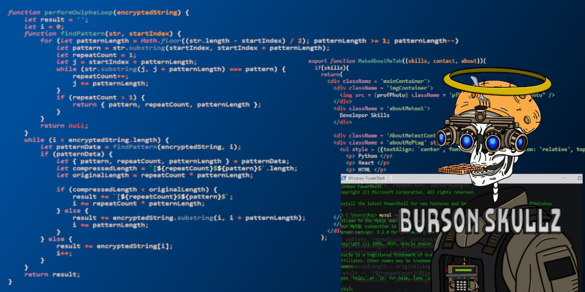

<!--
**bursonskullz/Bursonskullz** is a ✨ _special_ ✨ repository because its `README.md` (this file) appears on your GitHub profile.
-->

<picture>
  <!--source media="(prefers-color-scheme: dark)" srcset="YOUR-DARKMODE-IMAGE-URL"> -->
  <!--source media="(prefers-color-scheme: light)" srcset="YOUR-LIGHTMODE-IMAGE-URL">-->
  
</picture>

## About Me
- 🔭 **Currently working on**: Mastering full-stack web development.
- 🌱 **Learning**: React, Git version control, command-line interface (CLI) skills, regression analysis, machine learning algorithms and libraries, and neural network designs. Planning to explore Django, Angular, and PHP if time permits. Also learning Spanish as my first second language.
- 👯 **Looking to collaborate on**: Web development and machine learning projects.
- 💬 **Ask me about**: My repositories and [research papers](https://www.researchgate.net/profile/Roy-Burson-2).
- 😄 **Pronouns**: He/Him.
- ⚡ **Fun fact**: I am also an artist but not active in the field!

## GitHub Stats

  ## Contact Me
- 📫 [LinkedIn](https://www.linkedin.com/in/roy-burson-047199343/)
- 🐦 [X](https://x.com/burson_research)
- 💼 [Upwork](https://www.upwork.com/freelancers/~013a2d8e758f218f85)
  
## Professional Software Experience
- **Independent Researcher** (2019–Present)
  - Contributed to 11 research articles on mathematical problems, published on [ResearchGate](https://www.researchgate.net/profile/Roy-Burson-2), [arXiv](https://arxiv.org/), and academic journals.
  - Developed projects showcasing skills in data analysis, regression modeling, academic writing, and full-stack web development.
- **Freelance Developer/Artist** (2022–Present)
  - Built a live web application using HTML, CSS, and JavaScript to sell digital assets.
  - Designed and published two NFT collections: [Volume 1](https://opensea.io/collection/bursonskullz) and [Volume 2](https://opensea.io/collection/burson-skullz-v2), managing community engagement via a Discord server.
- **Research Analyst, IMASTECH LLC** (March 2021–October 2021)
  - Developed mathematical reports on void nucleation in ductile materials using C++ software for continuum mechanics modeling, focusing on crystal dislocation density effects.
- **Stress Analyst (Internship), Karagozian & Case, Inc.** (April 2019–May 2019)
  - Contributed mathematical expertise to the K&C concrete model for structural analysis, supporting engineering projects under John Crawford, P.E., and Dr. Pedram Hesam, S.E.
 
## Key Projects
- **[NFT Marketplace](https://github.com/bursonskullz/artWebsite)**: A live web application built with HTML, CSS, and JavaScript for selling digital assets. (Note: This repository is private due to sensitive database information, with plans to launch publicly in the future.)
- **[Base64 Compression Algorithm](https://github.com/bursonskullz/Base64Compression)**: A nearly completed algorithm in javascript to reduce storage costs of Base64 data, with successful preliminary tests. Theoretical framework published on [ResearchGate](https://www.researchgate.net/publication/384763205_BASE_64_FINITE_COMPRESSION_ALGORITHM).
- **[Bellman’s Forest Algorithm](https://github.com/bursonskullz/Forest-Algorithm)**: An in-progress project to solve Bellman’s Forest Problem, derived from my article on [ResearchGate](https://www.researchgate.net/publication/377466487_ACCEPTABLE_NUMERICAL_SIMULATION_ON_BELLMAN'S_FOREST_PROBLEM). Development paused due to time constraints.

## Education
- **B.S. in Mathematics**, California State University Northridge 
  - Relevant coursework: Partial Differential Equations, Numerical Analysis, Web Development
- **High School Diploma**, Eastside High School 

